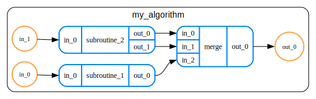

# QREF
Quantum Resource Estimation Format (QREF) is an open format for representing
quantum algorithms, optimized for usage in quantum resource estimation (QRE).

QREF comprises:

- Definition of data format, formalized as a JSON schema.
- A Python library for validation of quantum programs written in QREF format using [Pydantic](https://docs.pydantic.dev/).
- Rudimentary visualization tool `qref-render`.

## Installation

Using QREF data format does not require installation - you can easily write quantum
programs in YAML or JSON.

To install QREF Python package, clone this repository and install it as usual with `pip`:

```bash
# Clone QREF repo (you can use HTTP link as well)
git clone git@github.com:PsiQ/qref.git
cd qref
pip install .
```

## QREF format

QREF format represents quantum programs as a hierarchical directed acyclic graphs (DAGs).
That's a mouthful, so let us unpack what it means:

- *hierarchical*: each node can contain subgraphs, i.e. routines can be nested inside
  larger routines.
- *directed*: information flow is unidirectional, and the direction is unambiguous.
- *acyclic*: meaning there are no loops.

Consider the following hierarchical DAG of a hypothetical quantum program:



It can be succinctly written in QREF format as:


```yaml
version: v1
program:
  name: my_algorithm
  ports:
  - direction: input
    name: in_0
    size: 2
  - direction: input
    name: in_1
    size: 2
  - direction: output
    name: out_0
    size: 4
  children:
  - name: subroutine_1
    ports:
    - direction: input
      name: in_0
      size: 2
    - direction: output
      name: out_0
      size: 3
  - name: subroutine_2
    ports:
    - direction: input
      name: in_0
      size: 2
    - direction: output
      name: out_0
      size: 1
    - direction: output
      name: out_1
      size: 1
  - name: merge
    ports:
    - direction: input
      name: in_0
      size: 1
    - direction: input
      name: in_1
      size: 1
    - direction: input
      name: in_2
      size: 2
    - direction: output
      name: out_0
      size: 4
  connections:
  - source: in_0
    target: subroutine_1.in_0
  - source: in_1
    target: subroutine_2.in_0
  - source: subroutine_1.out_0
    target: merge.in_2
  - source: subroutine_2.out_0
    target: merge.in_0
  - source: subroutine_2.out_1
    target: merge.in_1
  - source: merge.out_0
    target: out_0
```


For full description of QREF format, check our [docs](https://example.com).

## Using QREF package

### Using JSON schema for validating data in QREF format

JSON schema for QREF format can be obtained by calling `generate_program_schema` function.
Such schema can be then used for validating user's input, e.g. using `jsonschema` package:

```python
from jsonschema import validate
from qref import generate_program_schema

# Hypothetical function loading your data as native Python dictionary.
data = load_some_program()
schema = generate_program_schema()

# This will raise if there are some validation errors.
validate(schema, data)
```

### Validation using Pydantic models

If you are familiar with Pydantic, you might find it easier to work with QREF Pydantic
models instead of interacting with JSON schema directly. In the example below, we create
an instance of `SchemaV1` model from validated data stored in QREF format:

```python
from qref import SchemaV1

data = load_some_program()

# This will raise if data is not valid
program = SchemaV1.model_validate(data)
```

## Development

In order to install development environment or build documentation locally, please refer to [Development Guide](TODO).