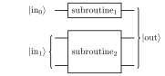

# Data format

## Introduction
In QREF, algorithms are described as a graph of subroutines. These graphs are by design hierarchical, directed, and acyclical. Let's break down
what this means:

- *Hierarchical* means that routines can be nested.
- *Directed* means that every edge connecting two routines also defines in which
  direction the information flows between them.
- *Acyclic* means that traversing the graph along its edges (respecting their direction)
  will never lead to visiting the same node twice.

Besides specifying the connectivity between routines in the algorithm, QREF
also specifies how to store information relevant to resource estimation. This extends to
known and unknown resources, parameters that might affect them and how the parameters
propagate in the algorithms graph.

Before describing the format in detail, let's see how QREF would handle a simple algorithm.

## Basic example

Consider a hypothetical algorithm as depicted in the following circuit.

{width="500"}

We can see that the circuit comprises two subroutines:

- `subroutine_1` operating on a single-qubit register.
- `subroutine_2` operating on a two-qubit register.

We also labelled inputs to the subroutines as `in_0` and `in_1`, and the whole
output of our circuit (i.e. combined outputs of both subroutines) as `out`.

Representing this circuit as a graph is straightforward, it might look like this:


The graph contains both subroutines from the original circuit,
as well as an artificially introduced `merge` operation used to combine outputs
from the subroutines into one final output.

Now that we have our graph, let's see how it can be represented in QREF.
As QREF is built on top of JSON we can write our algorithms
(or programs) in either JSON or YAML. For our example, those might look as follows:

=== "YAML"

    ```yaml
    --8<-- "basic_program.yaml"
    ```

=== "JSON"

    ```json
    --8<-- "basic_program.json"
    ```

The top-level object has **two mandatory properties**:

- `version`: Set to `v1` (which is the only version so far)
- `program`: This contains the description of our algorithm.

So what do we have in a `program` object?

- `name`: Each program requires a name, here set to the string `my_program`.
- `ports`: A collection of ports. They roughly correspond to quantum registers.
- `children`: A list of children, or subroutines, of the program.
- `connections`: A list defining edges of our graph. Intuitively, 
the connections property defines how the subroutines of a program interact.


Let's explore some of these properties in more detail!

### Ports
Here we highlight the first input port of our top level program, `my_program`:

```yaml
{direction: input, name: in_0, size: 1}
```

Like most components in QREF ports require names, and these should be unique for 
the ports of a given program (or subroutine). Each port also has direction, 
which can be either `input`, `output` or `through` (for ports serving as
both input and output). Finally, each port has a _size_.
In our simple scenario, all sizes are positive integers. 
However, entries to the size field can take on any of the following formats:

- A positive integer.
- A symbol or symbolic expression (e.g. `N` or `2L + 1`)
- A `null`, signifying that the size of the port can be deduced from sizes of
  other ports it is connected to (possibly transitively).

### Children

The `children` list comprises all subroutines of the program. Each entry has the
same structure as the program itself (such that the schema of `program`
is recursive). In particular, each child should have a name (unique in the scope
of their immediate parent) and some ports. They can also have connections, and their 
own children.

### Connections

The last component of any program (and most subroutines) are connections defining the
edges of a graph. The `connections` field is a list of objects, each having `source`
and `target`. Both `source` and `target` can either be:

- A name of the port of the program/subroutine the connection belongs to, i.e. `out_0`
- A reference to a port of one of program/subroutine's direct children.
  Such a reference is formatted as `child.port_name`.

There are three types of connections:

- Connections joining two distinct children, e.g.
  ```yaml
  {source: subroutine_1.out, target: merge.in_1}
  ```
- Connections joining a parent and its child e.g.:
  ```yaml
  {source: in_0, target: subroutine_1.in}
  ```
  or
  ```yaml
  {source: merge.out, target: out}
  ```
- Connections joining the input and output ports of a parent, known as passthroughs.
  There are no passthroughs in our simple example, but one could look like:
  ```yaml
  {source: in_0, target: out}
  ```

Writing connections in this way might be cumbersome. However, there exists
an alternative, more concise syntax. Instead writing:

```yaml
{source: a.out, target: b.in}
```
you can write:
```
"a.out -> b.in"
```

With this concise notation, the example program we've seen at the very
beginning looks as follows:

=== "YAML"

    ```yaml
    --8<-- "basic_program_concise.yaml"
    ```


### Repetitions

On top of the basic fields listed above, programs and subroutines can also be repeated.

These can be added with `repetition` field:

```yaml
repetition:
  count: ceil(1/eps)
  sequence:
    type: constant
    multiplier: 1
```

`repetition` consists of two parts:

- `count` – defines how many times this routine (and its subroutines) should be repeated.
- `sequence` – defines how the costs for the repetition will be aggregated. Each `sequence` has a field `type` which defines the type of the sequence. Depending on the type there are extra fields, summarized in the table below.


There are 5 different sequences currently implemented in QREF:


| <div style="width:7em">Sequence type</div> | <div style="width:8em">Additional fields</div> | Description | Example |
|-------|-------|-------|-------|
| `constant`| `multiplier` | In each iteration, each child is repeated `multiplier` number of times. | Trotterization |
| `arithmetic`| `difference`, `initial_term` | Iteration starts from `initial_term` repetitions of a child and then we increase the repetitions by `difference` in every iteration. | QFT | 
| `geometric` | `ratio` | In each iteration the number of repetitions is multiplied by `ratio`; starting at `1` repetition in the first iteration. | QPE |
| `closed_form` | `sum`, `prod`, `num_terms_symbol` | This can be used when we know the closed-form expression for the total cost of the routine, given the number of repetitions defined by `num_terms_symbol`. `sum` is an expression for additive resources and `prod` is for multiplicative. | Any |
| `custom` | `term_expression`, `iterator_symbol` | This can be used when we don't know the formula for closed form, but we do know the formula for each term, defined using `term_expression`. We use `iterator_symbol` to denote the iterator. | Any |


<!-- This representation necessarily abstracts out certain implementation details. Consider the implementation of QPE using a geometric sequence below. The child `U` of routine `Evolution` has two ports: `result` and `psi` with sizes `bits_of_precision` and  `N` respectively. Even though in the executable implementation each next controlled `U^2^i` only acts on one control qubit from the `result` register, there's currently no way of expressing it in QREF.

=== "YAML"

    ```yaml
    --8<-- "qpe.yaml"
    ``` -->

