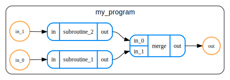

# QART Format

## Introduction
QART format is a domain-specific language (DSL) for describing quantum algorithms
built on top of JSON for the purpose of resource estimation.

In QART, the algorithms are described as programs comprising hierarchical, directed
acyclic graph (henceforth hierarchical DAGs) of subroutines. Let's break down
what this means:

- *Hierarchical* means that routines can be nested.
- *Directed* means that every edge connecting two routines also defines in which
  direction the information flows between them.
- *Acyclic* means that traversing the graph along its edges (respecting their direction)
  will never lead to visiting the same node twice.

Besides specifying the connectivity between routines in the algorithms, the QART format
also specifies how to store information relevant to resource estimation, such as
known and unknown resources, parameters that might affect them and how the parameters
propagate in the algorithm's graph.

Before describing the format in detail, let us first exemplify its usage on a simple program.

## Basic example

In QART, the quantum programs are represented as graphs. If you are not used to
representing computations as graph, don't worry! Before describing QART format,
we'll demostrate how a simple circuit can be represented as a graph.

Consider a hypothetical quantum program as depicted in the following circuit.

{width="500"}

Let's forget for a while that the depicted algorithm doesn't make much sense.
We can see that the circuit comprises two subroutines:

- `subroutine_1` operating on a single-qubit register.
- `subroutine_2` operating on a two-qubit register.

We also labelled inputs to the subroutines as `in_0` and `in_1`, and the whole
output of our program (i.e. combined outputs of both subroutines) as `out`.

Representing such a circuit as a graph is straightforward, it might look like this:



As we can see, the graph contains both subroutines form the original circuit,
and an artificially introduced `merge` operation used to combine outputs
from the subprograms into one final outputs.

Now that we have our graph, let's see how it can be represented in QART format.
As already mentioned, QART format is built on top of JSON, so we can write QART
files in either JSON or YAML. For our examples, those might look as follows:

=== "YAML"

    ```yaml
    --8<-- "basic_program.yaml"
    ```

=== "JSON"

    ```json
    --8<-- "basic_program.json"
    ```

Let's dissect our example. The top-level object has two mandatory properties:

- `version`: Set to `v1` (which is the only version so far)
- `program`: This contains the actual description of the program.

So what do we have in a `program` object?

- `name`: Mandatory name of the program, here set to the string `my_program`.
- `ports`: A collection of ports. For most of the time, not much is lost by
  thinking of them as of quantum registers.
- `children`: A list of children, or subroutines of the program.
- `connections`: A list defining edges of our graph.

Let us first take a look at ports, like the first input port of our program:

```yaml
{direction: input, name: in_0, size: 1}
```

Ports, like most other components in QART, have names, which should be distinct
among all ports of any given program (or subroutine). Each port also has
direction, which can be either `input` or `output`. Finally, each port has size.
In our simple scenario, all sizes are positive integers. However, QART
is not limited to them, and size of the port can be either:

- A positive integer.
- A symbol or symbolic expression (e.g. `N` or `2L + 1`)
- A `null`, signifying that the size of the port can be deduced from sizes of
  other ports it is connected to (possibly transitively).

The `children` list comprises all subroutines of the program. Each entry has the
same structure as the program itself (one could say that the schema of the `program`
is recursive). In particular, each child should have a name (unique in the scope
of their immediate parent) and some ports. They can also have connections, and their 
own children.

The last component of any program (and most subroutines) are connections defining the
actual graph. The `connections` field is a list of objects, each having `source`
and `target`.
