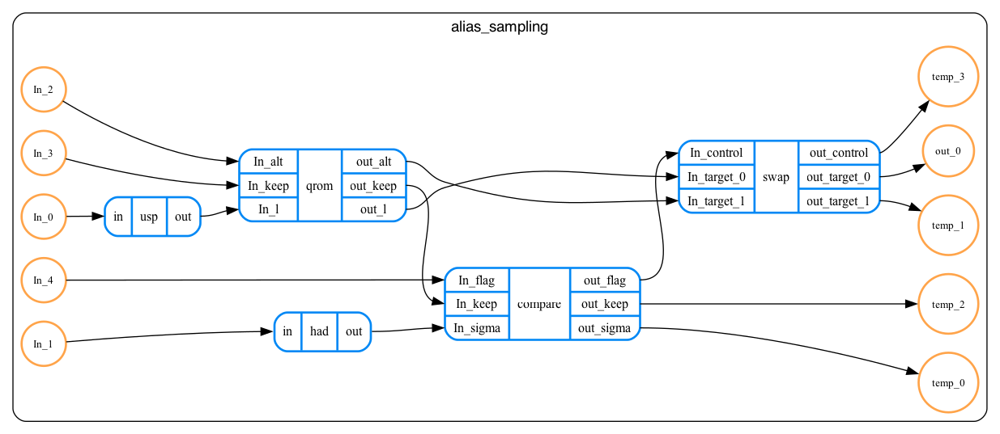

# User guide

## Installation

To install QREF Python package, clone QREF repository and install it as usual with `pip`:

```bash
# Clone QREF repo (you can use HTTP link as well)
git clone git@github.com:PsiQ/qref.git
cd qref
pip install .
```

Please note that to use rendering features you need a working [graphviz](https://graphviz.org)
installation.

## Usage


### Using JSON schema for validating data in QREF format

JSON schema for QREF format can be obtained by calling
[`generate_program_schema`][qref.generate_program_schema] function.
Such schema can be then used for validating user's input, e.g. using
[`jsonschema`](https://pypi.org/project/jsonschema/) package:

```python
from jsonschema import validate
from qref import generate_program_schema

# Hypothetical function loading your data as native Python dictionary.
data = load_some_program()
schema = generate_program_schema()

# This will raise if there are some validation errors.
validate(schema, data)
```

### Validation using Pydantic models

If you are familiar with [Pydantic](https://docs.pydantic.dev/latest/), you might find
it easier to work with QREF Pydantic models instead of interacting with JSON schema directly.
In the example below, we create an instance of [`SchemaV1`](qref.experimental.SchemaV1) model from
validated data stored in QREF format:

```python
from qref import SchemaV1

data = load_some_program()

# This will raise if data is not valid
program = SchemaV1.model_validate(data)
```

### Topology validation

There can be cases where a program is correct from the perspective of Pydantic validation, but has incorrect topology. This includes cases such as:

- Disconnected ports
- Ports with multiple connections
- Cycles in the graph

In order to validate whether the topology of the program is correct you can use `verify_topology` method. Here's a short snippet showing how one can verify their program and print out the problems (if any).

```python
from qref.verification import verify_topology

program = load_some_program()

verification_output = verify_topology(program)

if not verification_output:
    print("Program topology is incorrect, due to the following issues:")
    for problem in verification_output.problems:
        print(problem)

```

### Rendering QREF files using `qref-render` (experimental)

<div style="padding: 15px; border: 1px solid transparent; border-color: transparent; margin-bottom: 20px; border-radius: 4px; color: #8a6d3b;; background-color: #fcf8e3; border-color: #faebcc;">
 This feature is considered experimental and may occassionally produce
 incorrect results.
</div>

QREF comes with a CLI tool for rendering hierarchical graphs of quantum
algorithms. To render an algorithm stored in a file named `my_program.yaml` into a 
file `my_program_graph.svg` run:

```bash
qref-render my_program.yaml my_program_graph.svg
```

The `qref-render` tool supports `yaml` and `json` input formats, and all
output formats supported by [graphviz](https://graphviz.org/).

If you prefer to use QREF's rendering capabilities from a Python script instead of the CLI, you can use the [`qref.experimental.rendering`](qref.experimental.rendering) module,  which performs the same task as `qref-render`. Here, we demonstrate how to use the rendering module to visualize quantum circuits for preparing arbitrary quantum states in alias sampling. To learn more about the algorithm, please refer to the tutorial for [Bartiq](https://psiq.github.io/bartiq/latest/tutorials/02_alias_sampling_basic/) – our library for symbolic resource estimation.

We will use the `yaml` file `alias_sampling_detailed_fixed_resources.yaml` as input to generate a graph representing this algorithm:

```python
import yaml
from qref import SchemaV1
from qref.experimental.rendering import to_graphviz

# Load the YAML file
with open("../examples/alias_sampling.yaml", "r") as f:
    data = yaml.safe_load(f)

# Validate the schema and convert to Graphviz object
program = SchemaV1.model_validate(data)
gv_object = to_graphviz(program)

# Render the Graphviz object to a PNG file
gv_object.render("alias_sampling", format="png")
```

